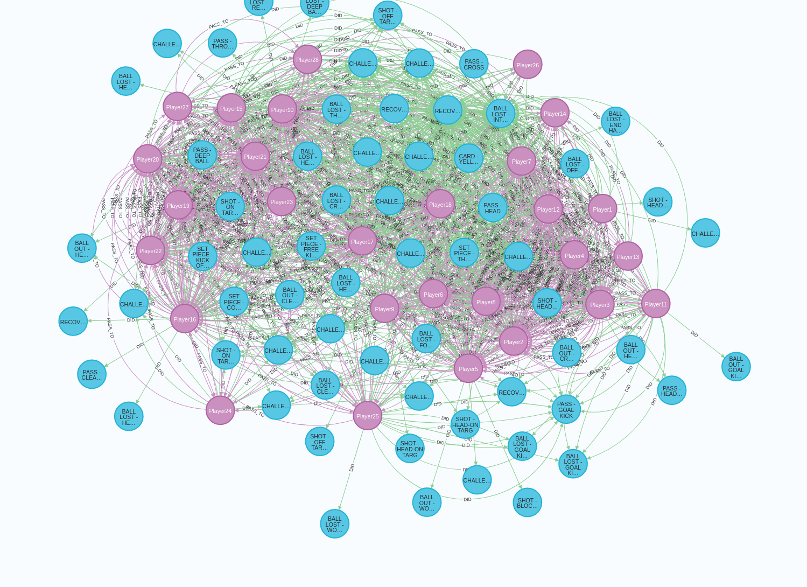
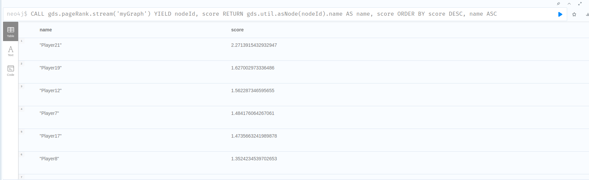
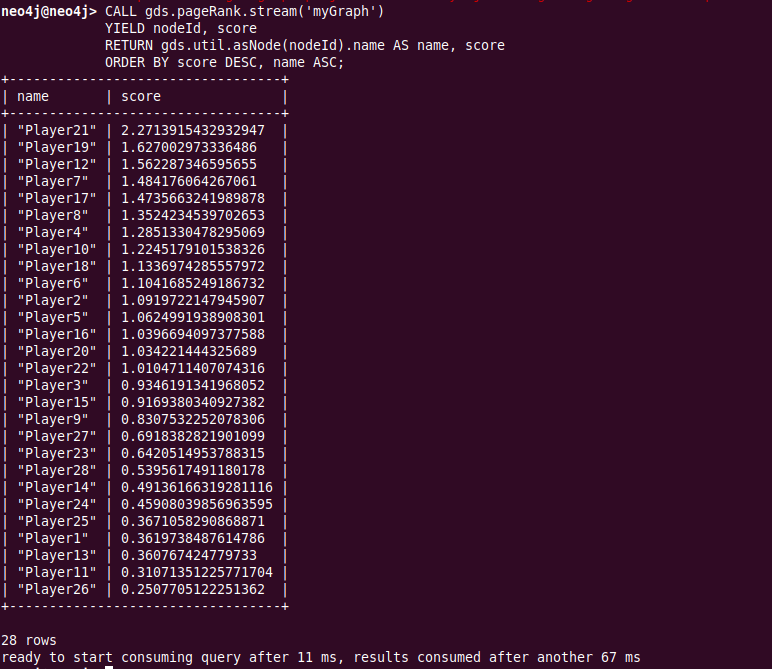
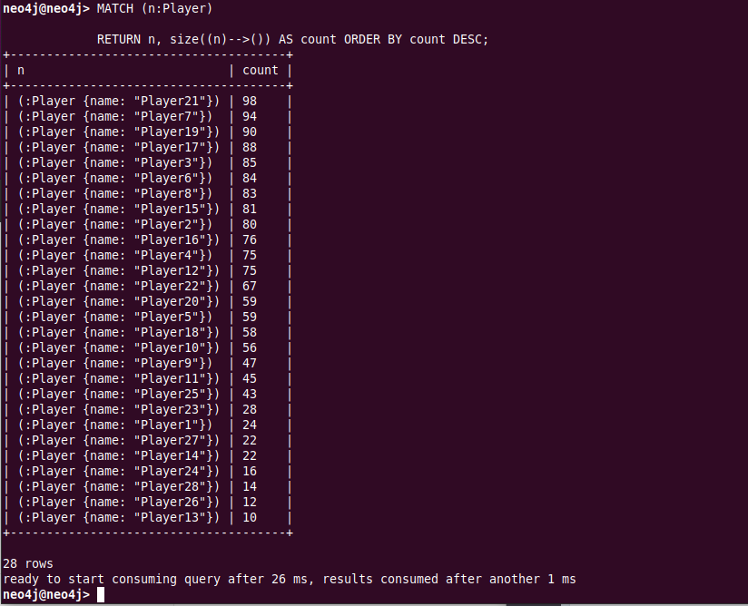

# db_assignment4_neo4j

Neo4j installed on ubuntu 20.04 using install.sh followed by install_plugins.sh.

Aftwerwards data is seeded in cypher-shell with commands from 'import'

The result is a graph that the desktop browser will let us visualize as follows:

# GDS

With GDS we can then use algorithms like pagerank (how central each player is, also taking into account how important players close to him are) - is it a meaningful analysis for this? No - but it show GDS is working which means it's good enough in my book...

# Simple calls
We can also make simple calls to see who made the most passes:

MATCH (n:Player)
RETURN n, size((n)-->()) AS count ORDER BY count DESC;

